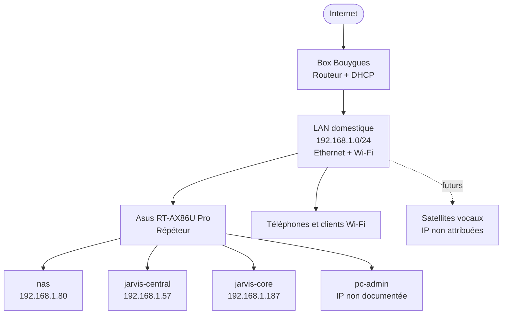
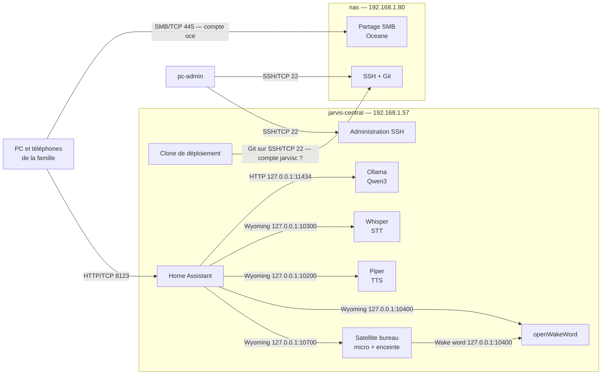
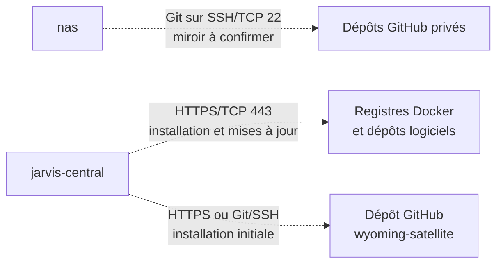
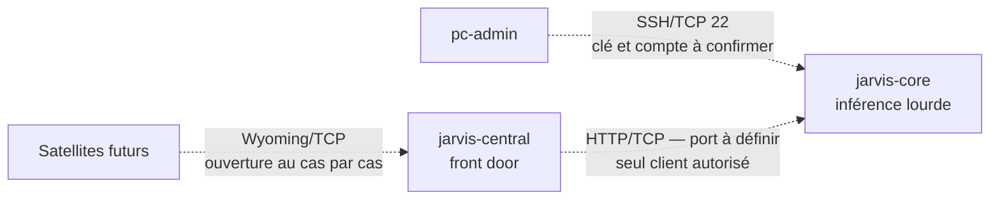
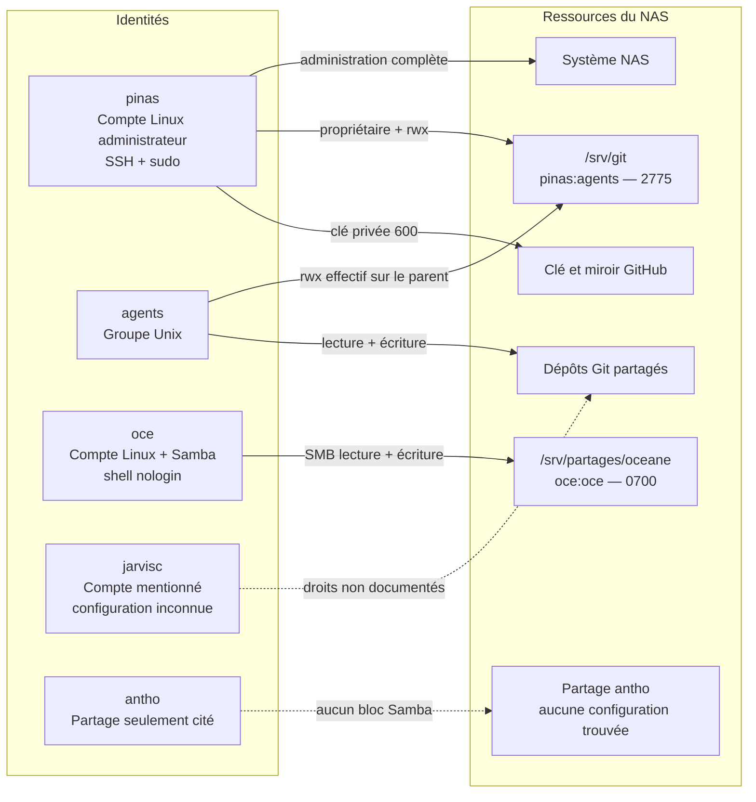

# Homelab — référence consolidée

> Rôle : point d'entrée unique pour comprendre le socle réellement déployé,
> l'adressage, les communications et les droits du NAS.
> Date de consolidation : 31 juillet 2026.
> Périmètre volontairement exclu : `backlog.md`, archives et pistes
> d'exploration non validées.

## 0. Comment lire ce document

Cette synthèse sépare systématiquement :

- **Déployé** : confirmé par un état serveur ou une configuration exécutable.
- **Cible** : architecture décidée ou envisagée, mais pas encore déployée.
- **À confirmer** : information contradictoire ou insuffisamment documentée.

En cas d'écart, l'ordre de confiance retenu est : configuration exécutable,
état courant d'un serveur, procédure d'installation, puis document
d'architecture.

## 1. État du socle

```text
Ubuntu Server 26.04 LTS (headless, SSH)
 ├── Driver NVIDIA (RTX 2060 visible : nvidia-smi)
 │    └── Docker (groupe docker → sans sudo)
 │         └── NVIDIA Container Toolkit (--gpus all fonctionnel)
 │              ├── [conteneur] ollama          (port 11434, GPU)
 │              ├── [conteneur] homeassistant   (port 8123, network host)
 │              ├── [conteneur] whisper         (port 10300, STT, CPU)
 │              ├── [conteneur] piper           (port 10200, TTS, CPU)
 │              └── [conteneur] openwakeword    (port 10400, wake word, CPU)
 └── wyoming-satellite (sur l'hôte, port 10700 — exception justifiée, §2.4)
```

Ce socle est celui de `jarvis-central`. Les cinq conteneurs sont gérés par
Docker Compose. Leur source de vérité est
[`deploiement/jarvis-central/docker-compose.yml`](deploiement/jarvis-central/docker-compose.yml).
`wyoming-satellite` est la seule brique applicative installée directement sur
l'hôte ; elle tourne sous systemd avec l'utilisateur `jarvis`.

Les données persistantes sont séparées des conteneurs :

| Donnée | Emplacement sur `jarvis-central` | Nature |
|---|---|---|
| Compose déployé | `/srv/jarvis/docker-compose.yml` | Copie de la configuration versionnée |
| Configuration Home Assistant | `/srv/homeassistant/` | Bind mount critique et persistant |
| Modèles Whisper | `/srv/wyoming/whisper/` | Bind mount persistant |
| Modèles Piper | `/srv/wyoming/piper/` | Bind mount persistant |
| Modèles Ollama | volume Docker `ollama` | Volume externe persistant |
| Satellite vocal | `/home/jarvis/wyoming-satellite/` | Clone et environnement Python sur l'hôte |
| Unité systemd | `/etc/systemd/system/wyoming-satellite.service` | Copie de la configuration versionnée |

## 2. Réseau et adressage

### 2.1 Topologie



- Aucun port entrant n'est redirigé depuis Internet.
- Le routeur Asus étend le LAN existant : il ne crée pas de sous-réseau ni de
  VLAN dans l'état documenté.
- Les adresses sont fournies par DHCP et ne font pas encore l'objet de
  réservations confirmées. Elles peuvent donc changer.
- Les configurations machine-à-machine utilisent les IP, pas le mDNS
  (`*.local`). Les humains utilisent les alias définis dans le fichier SSH du
  poste d'administration.

### 2.2 Adresses des machines

| Machine | Rôle | Adresse actuelle | Liaison | État |
|---|---|---:|---|---|
| `nas` | Git, persistance et partage SMB | `192.168.1.80` | Ethernet | Déployé ; IP non réservée |
| `jarvis-central` | Front door 24/7, voix, domotique et petit LLM | `192.168.1.57` | Ethernet | Déployé ; IP non réservée |
| `jarvis-core` | Future inférence LLM lourde | `192.168.1.187` | Ethernet | Raccordé ; aucun socle/service Jarvis confirmé |
| `pc-admin` | Administration du parc | Non documentée | Ethernet/portable | À constater |
| Satellites futurs | Interfaces vocales distribuées | Non attribuées | Wi-Fi prévu | Cible |

Il n'existe pas d'adressage IP Docker stable documenté. Les services sont
adressés par l'IP de leur hôte et leur port publié ; les IP internes des
conteneurs ne doivent pas être utilisées comme contrat d'architecture.

### 2.3 Adresses des services

| Hôte | Point d'accès | Protocole | Service | Exposition réellement configurée | État |
|---|---|---|---|---|---|
| `nas` | `192.168.1.80:22` | SSH/TCP | Administration et Git natif | LAN | Déployé |
| `nas` | `192.168.1.80:445` | SMB/TCP | Partage familial | LAN | Partage `Oceane` confirmé |
| `jarvis-central` | `192.168.1.57:22` | SSH/TCP | Administration | LAN | Déployé |
| `jarvis-central` | `http://192.168.1.57:8123` | HTTP/TCP | Home Assistant | LAN via `network_mode: host` | Déployé |
| `jarvis-central` | `http://192.168.1.57:11434` | HTTP/TCP | API Ollama | Tout le LAN (`0.0.0.0`) | Déployé |
| `jarvis-central` | `192.168.1.57:10200` | Wyoming/TCP | Piper, synthèse vocale | Tout le LAN (`0.0.0.0`) | Déployé |
| `jarvis-central` | `192.168.1.57:10300` | Wyoming/TCP | Whisper, transcription | Tout le LAN (`0.0.0.0`) | Déployé |
| `jarvis-central` | `192.168.1.57:10400` | Wyoming/TCP | openWakeWord | Tout le LAN (`0.0.0.0`) | Déployé |
| `jarvis-central` | `192.168.1.57:10700` | Wyoming/TCP | Satellite vocal `bureau` | Tout le LAN (`0.0.0.0`) | Déployé |
| `jarvis-core` | `192.168.1.187:22` | SSH/TCP | Administration | Accès prévu depuis `pc-admin` | À confirmer |
| `jarvis-core` | Port non défini | HTTP/TCP envisagé | API d'inférence lourde | Devra être limitée à `jarvis-central` | Cible |

Pour les communications internes à `jarvis-central`, les clients utilisent la
boucle locale : `127.0.0.1:11434`, `:10200`, `:10300`, `:10400` et `:10700`.
Cela n'empêche pas l'écoute sur le LAN : le Compose publie actuellement les
ports `11434`, `10200`, `10300` et `10400` sans adresse de liaison, tandis que
l'unité systemd du satellite déclare explicitement `0.0.0.0:10700`.

Aucun HTTPS, reverse proxy, DNS interne, MQTT ou mécanisme d'authentification
pour Ollama/Wyoming n'est documenté.

## 3. Communications — qui parle à qui

### 3.1 Flux opérationnels



Chaque accès SSH depuis `pc-admin` emploie une clé ed25519 propre à la
machine cible. Le mot de passe reste accepté en secours sur le NAS et encore
accepté sur `jarvis-central`. Le compte NAS `jarvisc`, cité pour le clone de
déploiement, n'a pas de droits documentés. Ollama et Wyoming n'ajoutent aucune
authentification réseau propre.

### 3.2 Flux sortants ou non permanents



Les traits pointillés indiquent des flux ponctuels ou dont l'activation réelle
n'est pas confirmée.

Le miroir GitHub est un flux **sortant uniquement**. Il ne constitue pas une
exposition entrante du NAS. Les dépôts concernés doivent rester privés et ne
contenir aucun secret.

### 3.3 Flux cibles, non déployés



Le sens du calcul lourd est invariant : `jarvis-central` appelle
`jarvis-core`; `jarvis-core` n'appelle pas la front door pour lui soumettre du
travail.

## 4. NAS — identités et droits

### 4.1 Modèle général

Le NAS sépare trois périmètres : administration système, dépôts Git techniques
et fichiers familiaux. Un compte d'un périmètre n'obtient pas implicitement de
droits dans un autre.



`agents` ne doit obtenir ni sudo ni accès au partage d'Océane. `oce` n'a ni
shell, ni sudo, ni accès Git documenté. Les liens pointillés signalent une
identité incomplètement ou contradictoirement documentée.

### 4.2 Droits par ressource

| Ressource | Propriétaire / groupe | Mode ou règle | Effet réel |
|---|---|---|---|
| `/srv/git` | `pinas:agents` | `2775` | `pinas` **et les membres de `agents`** peuvent lister, traverser, créer, renommer et supprimer des entrées ; le bit setgid transmet le groupe `agents` |
| `/srv/git/<depot>.git` | Hérité, dépôt partagé | `core.sharedRepository=group` / `--shared=group` | Propriétaire et groupe peuvent travailler dans le dépôt sans conflit de permissions |
| Dépôts déclarés fiables | Configuration Git système | `safe.directory` par dépôt | Autorise Git à opérer malgré un propriétaire différent ; ce n'est pas un droit Unix supplémentaire |
| `/home/pinas/.ssh/id_ed25519_github` | `pinas` | Clé privée `600` attendue | Seul `pinas` peut pousser le miroir GitHub |
| Hook `post-receive` | `pinas:agents` | Exécutable | Tourne sous le compte qui effectue le push ; un push agent ne dispose donc pas de la clé privée de `pinas` |
| `/srv/partages/oceane` | `oce:oce` | `0700` | Seul `oce` peut lire, écrire ou traverser ce dossier |
| Fichiers créés via `[Oceane]` | `oce` | `create mask = 0600` | Lecture/écriture pour `oce` uniquement |
| Dossiers créés via `[Oceane]` | `oce` | `directory mask = 0700` | Lecture/écriture/traversée pour `oce` uniquement |

Le partage Samba confirmé est :

```ini
[Oceane]
   path = /srv/partages/oceane
   valid users = oce
   read only = no
   browseable = yes
   create mask = 0600
   directory mask = 0700
```

Adresse cliente : `\\192.168.1.80\Oceane`, port TCP `445`, utilisateur
`oce`.

### 4.3 Règles de séparation à conserver

1. `pinas` est l'identité d'administration ; aucune application autonome ne
   doit recevoir ses droits ou sa clé privée.
2. Un compte agent peut accéder uniquement aux dépôts dont il a besoin via le
   groupe `agents`, jamais à `/srv/partages/oceane`.
3. `oce` reste une identité SMB sans shell et sans accès aux dépôts.
4. La clé GitHub du NAS est une Deploy Key limitée à un seul dépôt, sans
   passphrase uniquement parce que le hook est non interactif.
5. Une paire de clés SSH distincte est utilisée par machine cible depuis
   `pc-admin` : `id_ed25519_nas`, `id_ed25519_jarvis-central`, puis
   `id_ed25519_jarvis-core` quand ce dernier sera administrable.

### 4.4 Écart de permissions important

La documentation existante affirme que seul `pinas` peut créer ou supprimer
des dépôts sous `/srv/git`. Ce résultat n'est pas garanti par le mode `2775` :
le groupe `agents` possède lui aussi le droit d'écriture sur le dossier parent,
ce qui permet à ses membres de créer, renommer ou supprimer ses entrées.

La règle métier « agents : travail dans les dépôts, pas de gestion des dépôts »
est donc une **intention**, pas une restriction Unix effectivement démontrée
par les permissions décrites.

## 5. Exposition et limites de sécurité actuelles

| Sujet | État consolidé |
|---|---|
| Internet entrant | Aucune redirection de port documentée |
| Pare-feu `jarvis-central` | UFW non configuré |
| Ollama | API sans authentification, publiée sur tout le LAN |
| Wyoming | Ports sans authentification, publiés sur tout le LAN |
| Home Assistant | Conteneur privilégié et réseau hôte |
| SSH `jarvis-central` | Clé disponible, mais mot de passe encore accepté |
| SSH `nas` | Clé disponible, mot de passe volontairement conservé en secours |
| Sauvegardes | Aucune sauvegarde opérationnelle confirmée pour HA ou les fichiers SMB |
| `jarvis-core` | Aucun service Jarvis confirmé ; posture à définir avec son futur socle |

La portée « local uniquement » signifie aujourd'hui « accessible depuis le
LAN », pas nécessairement « lié à `127.0.0.1` ». C'est particulièrement
important pour Ollama et Wyoming.

## 6. Points à confirmer avant de considérer la référence complète

Ces points proviennent d'incohérences dans les documents existants, pas d'une
liste de tâches externe :

1. Les réservations DHCP des quatre machines ne sont pas confirmées.
2. L'adresse de `pc-admin` n'est pas documentée.
3. Le compte NAS `jarvisc` est cité sans procédure de création, clé SSH,
   appartenance au groupe `agents` ni périmètre d'accès.
4. La matrice réseau annonce des partages SMB « Océane et antho », mais seule
   la configuration `[Oceane]` existe dans la documentation d'installation.
5. L'intention « seuls les administrateurs gèrent les dépôts » contredit le
   droit d'écriture du groupe `agents` sur `/srv/git` en mode `2775`.
6. Le miroir GitHub est décrit dans l'architecture, mais sa procédure porte
   encore la mention « à dérouler » : son activation n'est pas prouvée.
7. `jarvis-core` possède une IP constatée, mais aucun OS serveur, compte SSH,
   serveur d'inférence, port ou API n'est confirmé.

## 7. Sources conservées

Cette référence ne supprime ni ne remplace les détails opérationnels. Elle les
relie :

- [`architecture/reseau.md`](architecture/reseau.md) : topologie, IP et
  matrice réseau.
- [`architecture/nas.md`](architecture/nas.md) : rôle et modèle d'accès du
  NAS.
- [`architecture/securite.md`](architecture/securite.md) : posture de
  sécurité.
- [`architecture/inference.md`](architecture/inference.md) : sens du flux
  entre `jarvis-central` et `jarvis-core`.
- [`serveurs/nas/installation.md`](serveurs/nas/installation.md) : comptes,
  permissions Git et Samba.
- [`serveurs/jarvis-central/etat.md`](serveurs/jarvis-central/etat.md) : état
  réel du pipeline vocal.
- [`serveurs/jarvis-central/installation.md`](serveurs/jarvis-central/installation.md) :
  socle système.
- [`serveurs/pc-admin/installation.md`](serveurs/pc-admin/installation.md) :
  conventions et clés SSH.
- [`deploiement/jarvis-central/`](deploiement/jarvis-central/) : configuration
  exécutable déployée sur `jarvis-central`.
